# Lab 2


### 1. Run SPEC CPU2006 Benchmarks in gem5

In this first section the following **SPEC CPU2006 Benchmarks** were used, in order to discovers the CPU capabilities:

- **401.bzip2** is a benchmark which forces the CPU compress and decompress different types of files.

  ```bash
  ./build/ARM/gem5.opt -d spec_results/specbzip configs/example/se.py --cpu-type=MinorCPU --caches --l2cache -c spec_cpu2006/401.bzip2/src/specbzip -o "spec_cpu2006/401.bzip2/data/input.program 10" -I 100000000
  ```

- **429. mcf** is a benchmark which is derived from **MCF**, a program used for single-depot vehicle scheduling in public mass transportation.

  ```bash
  ./build/ARM/gem5.opt -d spec_results/specmcf configs/example/se.py --cpu-type=MinorCPU --caches --l2cache -c spec_cpu2006/429.mcf/src/specmcf -o "spec_cpu2006/429.mcf/data/inp.in" -I 100000000
  ```

- **456.hmmer** is a benchmark which forces CPU to analyze protein sequences using profile hidden Markov models

  ```bash
  ./build/ARM/gem5.opt -d spec_results/spechmmer configs/example/se.py --cpu-type=MinorCPU --caches --l2cache -c spec_cpu2006/456.hmmer/src/spechmmer -o "--fixed 0 --mean 325 --num 45000 --sd 200 --seed 0 spec_cpu2006/456.hmmer/data/bombesin.hmm" -I 100000000
  ```

- **458.sjeng** is a benchmark which uses a highly-ranked chess program that also plays several chess variants.

  ``` bash
  ./build/ARM/gem5.opt -d spec_results/specsjeng configs/example/se.py --cpu-type=MinorCPU --caches --l2cache -c spec_cpu2006/458.sjeng/src/specsjeng -o "spec_cpu2006/458.sjeng/data/test.txt" -I 100000000
  ```

- **470.lbm** is a benchmark which implements the so-called "Lattice Boltzmann Method" to simulate incompressible fluids in 3D.

  ```bash
  ./build/ARM/gem5.opt -d spec_results/speclibm configs/example/se.py --cpu-type=MinorCPU --caches --l2cache -c spec_cpu2006/470.lbm/src/speclibm -o "20spec_cpu2006/470.lbm/data/lbm.in 0 1 spec_cpu2006/470.lbm/data/100_100_130_cf_a.of" -I 100000000
  ```

  

#### 1.1 Cache Memory parameters

The generated files *config.ini* contain information about all configurable parameters of the simulation. The parameters about cache memories mainly concern: 

* **L1 Instruction Cache size**

  *Line 833, [system.cpu.icache]*: The variable size = 32768 indicates that the L1-Instruction Cache has a size of **32kB**.

* **L1 Instruction Cache Associativity**

  *Line 816, [system.cpu.icache]*: The variable assoc = 2 indicates that the L1-Instruction Cache has a 2-way Set Associativity.

* **L1 Data Cache size**

  *Line 169, [system.cpu.dcache]*: The variable size = 65536 indicates that the L1-Data Cache has a size of **64kB**.

* **L1 Data Cache Associativity**

  *Line 152, [system.cpu.dcache]*: The variable assoc = 2 indicates that the L1-Data Cache has a 2-way Set Associativity.

* **L2 Cache size**

  *Line 1078, [system.l2]*: The variable size = 2097152 indicates that L2-Cache has a size of **2MB**.

* **L2 Cache Associativity**

  *Line 1061, [system.l2]*: The variable assoc = 8 indicates that L2-Cache has a 8-way Set Associativity.

* **Cache Line size**

  *Line 15, [system]*: The variable cache_line_size = 64 indicates that the size of the Cache Line is **64 Bytes**

---


#### 1.2 Execution Time, CPI & Miss Rates

The following results about the simulation time, the CPI, L1 icache miss rate, L1 dcache miss rate and L2 cache miss rate were observed, running the benchmarks with the default parameters:

- **L1 icache** *size=32kB* & *assoc=2*
- **L1 dcache** *size=64kB* & *assoc=2*
- **L2 cache** *size=2048kB* & *assoc=8*
- *cache line size=64B*

|           | simulation seconds | cycles per instruction (CPI) | L2 cache miss rate | L1 i-cache miss rate | L1 d-cache miss rate |
| :-------: | :----------------: | :--------------------------: | :----------------: | :------------------: | :------------------: |
| **bzip**  |      0.083654      |           1.673085           |      0.295247      |       0.000075       |       0.014312       |
|  **mcf**  |      0.062553      |           1.251067           |      0.067668      |       0.019032       |       0.002062       |
| **hmmer** |      0.070205      |           1.404100           |      0.031973      |       0.000170       |       0.006198       |
| **sjeng** |      0.513823      |          10.276466           |      0.999978      |       0.000020       |       0.121831       |
|  **lbm**  |      0.174763      |           3.495270           |      0.999940      |       0.000095       |       0.060972       |

The results can be more easily interpreted, using plots:

<p allign = "center">
    

---


<p allign = "center">
    

---


<p allign = "center">
    

---


<p allign = "center">
    

---


<p allign = "center">
    


Obviously, the **CPI** is affected both from L2 miss rate and L1 miss rate. As those miss rates are increased, CPI is also increased. This fact makes sense because every time the CPU makes a miss in L1 cache or L2 cache, there is a time penalty. Nevertheless, the time penalty of L2 cache is significantly bigger, as the L2 cache is a slower memory than L1 cache. 


---

#### 1.3 Understanding System Clock and CPU Clock

The configuration file *config.ini* includes useful information about different clocks of the generated system. The clock under the tag **[system.clk_domain]** and the clock under the tag **[system.cpu_clk_domain]**. This values refer to the total number of system ticks, in order to produce a signal (clock). Given that the system simulates 1,000,000,000,000 , the **system.clk_domain clock**, which is 1000 ticks, corresponds to a clock of 1 GHz. Similarly, the **system.cpu_clk_domain clock**, which is 500 ticks, corresponds to a clock of 2 GHz. These 2 different clocks define different subsystems of the simulated system, namely the **CPU** and the **Main Memory**. L2 cache takes over the role of a *communication bridge*, between these two systems and for this reason should be able to communicate in different clock rates, when *system.clk_domain* and *system.cpu_clk_domain* clock have not the same value. Changing the CPU clock's frequency to 1GHz comes with a change at *system.cpu_clk_domain* clock at 1GHz, which also affects the communication rate between CPU and L2 cache. The results of the benchmarks can be seen below:

|           | simulation seconds | cycles per instruction (CPI) | L2 cache miss rate | L1 i-cache miss rate | L1 d-cache miss rate |
| :-------: | :----------------: | :--------------------------: | :----------------: | :------------------: | :------------------: |
| **bzip**  |      0.160359      |           1.603595           |      0.295235      |       0.000075       |       0.014123       |
|  **mcf**  |      0.123265      |           1.232645           |      0.067668      |       0.019046       |       0.002062       |
| **hmmer** |      0.140134      |           1.401339           |      0.031973      |       0.000170       |       0.006197       |
| **sjeng** |      0.705640      |           7.056395           |      0.999978      |       0.000020       |       0.121831       |
|  **lbm**  |      0.262262      |           2.622616           |      0.999940      |       0.000095       |       0.060972       |


Comparing this table with the previous results with the CPU clock at 2GHz, we come up with some meaningful conclusions. First of all the Miss Rates of the different levels of caches are not affected of the change in the CPU clock. On the other hand, what is strongly connected with the CPU clock are the simulation seconds and the CPIs. The reason for this to happen is that L1 icache, as well ass L2 dcache are clocked in the CPU frequency and so the miss penalty time is higher. We can see the development of those measurements in the following table:

|           | Simulation Seconds Increase | Cycles pre Instruction Decrease |
| :-------: | :-------------------------: | :-----------------------------: |
| **bzip**  |           91.71%            |              4.15%              |
|  **mcf**  |           97.05%            |              1.47%              |
| **hmmer** |           99.61%            |              0.01%              |
| **sjeng** |           37.33%            |             31.33%              |
|  **lbm**  |           38.62%            |             24.97%              |

The first three benchmarks, namely *bzip*, *mcf* and *hmmer* had the most remarkable increment in the simulation time, as the total seconds were almost doubled. On the other hand, the last two benchmarks, namely *sjeng* and *lbm* show a larger decrease on the total CPI.

In conclusion the most important parameter of the simulated system by the means of time performance is the L2 cache. Going back from 1GHz CPU clock to 2GHz we can observe that the benchmarks with high L2 Cache Miss Rates are not able to achieve such a simulation time compression, as the other ones. The reason behind this observation is the high time-penalty of the L2 cache when a "miss" occurs, due to the slower speed of this level of cache memory. 


### 2. Design Exploration & Performance Optimization

Now that we have already run some basic benchmarks it is the time to analyze the influence of specific parameters to the performance of the system, measured in CPIs. The configurable parameters are given to the system with the form of the following arguments:

- *--l1i_size*
- *--l1i_assoc*
- *--l1d_size*
- *--l1d_assoc*
- *--l2_size*
- *--l2_assoc*
- *--cacheline_size*


#### 2.1. Understanding the measurements of each benchmark

In order to understand which parameters to configure to achieve a lower CPI for each benchmark, it is useful to study the total Accesses and Miss Rates for the different levels of Caches.

| Benchmarks |    CPI    | dcache Miss Rate | dcache Accesses | icache Miss Rate | icache Accesses | L2 Miss Rate | L2 Accesses |
| :--------: | :-------: | :--------------: | :-------------: | :--------------: | :-------------: | ------------ | ----------- |
|  specbzip  | 1,673085  |     0,014312     |   52.072.437    |     0,000075     |   10.278.676    | 0,295247     | 683,552     |
|  specmcf   | 1,251067  |     0,002062     |   35.689.499    |     0,019032     |   28.116.952    | 0,067668     | 589,157     |
| spechmmer  |  1,4041   |     0,006198     |   47.807.608    |     0,00017      |   15.475.019    | 0,031973     | 176,87      |
| specsjeng  | 10,276466 |     0,121831     |   86.380.830    |     0,00002      |   32.145.417    | 0,999978     | 5.264.013   |
|  speclibm  |  3,49527  |     0,060972     |   48.795.269    |     0,000095     |    6.046.498    | 0,99994      | 1.488.206   |


##### 2.1.1 bzip

The table above indicates that icache has a really low Miss Rate, while the dcache is bounded to a noticeably larger Miss Rate. This fact in combination with the higher Accesses of the dcache indicates that a significant amount of the CPU latency occurs because of this L1 dcache. The same measurements can be observed for the L2 cache. For this reason, it would be advisable to improve those two parameters, as well as the cache line size.

---

##### 2.1.2 mcf


---

##### 2.1.3 hmmer


---

##### 2.1.4 sjeng


---

##### 2.1.5 lbm


---


#### 2.2. Influence of Parameters in CPIs

The default parameters of the system are:

- **L1 icache** *size=32kB* & *assoc=2*
- **L1 dcache** *size=64kB* & *assoc=2*
- **L2 cache** *size=2048kB* & *assoc=8*
- *cache line size=64B*

These parameters will be modified in order to achieve high system performance by the meaning of low CPI. In this experiment we will take into account that these parameters can only take distinct values, as well as that there exist some upper limitations:

- Maximum combined L1 instruction-cache size and l1 data-cache size must not exceed 256kB.

- Maximum L2 cache size must not exceed 4MB.
- Cache size is discrete powers of 2 (16kB, 32kB,...) which means that L1 icache and L1 dcache are at 16kB,32kB,64kB,128kB and L2 Cache is respectively 512kB, 1024kB, 2048kB, 4096kB.

- Commonly used n-set Associativities are 1,2,4,8,16

- Commonly used cache line sizes are 16,32,64,128 Bytes.

The following paragraphs contain useful data presentation, by plotting the CPI for changes in the parameters described above. Our goal is the modification of those parameters in order to achieve lower CPI. 


##### 2.2.1 Size of L1 cache (icache & dcache)

**On this point, we will also make the assumption that the the sizes of L1 i-cache and L1 d-cache retain the analogy 1:2, in order to simplify our analysis.** 

At first their capacity will be decreased by one half (icache : 16kB and dcache : 32kB) and then it will be doubled (icache: 64 kB and dcache 128 kB). The limitation of summed size less than 256 kB forbids additional experiments. The results are show below:

|  Benchmarks  |   bzip   |   mcf    |  hmmer   |   sjeng   |   lbm    |
| :----------: | :------: | :------: | :------: | :-------: | :------: |
| l1size_1632  |  1,7072  | 1,331166 | 1,414997 | 10,271068 | 3,503012 |
|   default    | 1,673085 | 1,251067 |  1,4041  | 10,276466 | 3,49527  |
| l1size_64128 | 1,644713 | 1,146373 | 1,383996 | 10,276674 | 3,49527  |

<p allign = "center">
    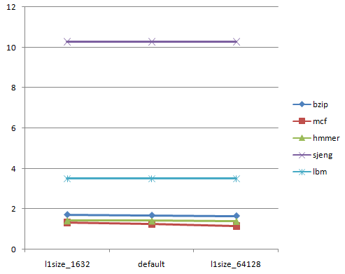
</p>

As we can see the increase of the size of L1 caches causes less CPI for the first three benchmarks, while it does not affect the last two. The main reason for this is the high L2 miss rates.


---

##### 2.2.2 Size of L2 cache

The size of L2 cache is changed respectively to the values 512kB, 1024kB and 4096kB. The results are shown below:

| Benchmarks  |   bzip   |   mcf    | hmmer  |   sjeng   |   lbm    |
| :---------: | :------: | :------: | :----: | :-------: | :------: |
| l2size_512  | 1,755657 | 1,261263 | 1,4041 | 10,277807 | 3,498384 |
| l2size_1024 | 1,703159 | 1,25562  | 1,4041 | 10,279562 | 3,50515  |
|   default   | 1,673085 | 1,251067 | 1,4041 | 10,276466 | 3,49527  |
| l2size_4096 | 1,646081 | 1,250532 | 1,4041 | 10,270133 | 3,498633 |

<p allign = "center">
    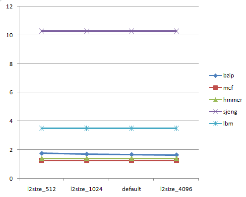
</p>


Even though we expected that the size of L2 cache will affect the CPI for the high L2 Miss Rate benchmarks, namely *sjeng* and *lbm*, the increase of its size does not impact the overall performance. On the other hand the *bzip* benchmark shows a decrease of the CPI.


---

##### 2.1.3 Associativity of L1 cache (icache & dcache)

As we did with the size of L1 caches, also here we assume that the associativities of L1 icache and dcache are mightily connceted. The associativity of L1 caches is changed respectively to the values 1, 4 and 8. The results are shown below:

| Benchmarks |   bzip   |   mcf    |  hmmer   |   sjeng   |   lbm    |
| :--------: | :------: | :------: | :------: | :-------: | :------: |
|  l1assoc1  | 1,697535 | 1,341859 | 1,448249 | 10,274614 | 3,510727 |
|  default   | 1,673085 | 1,251067 |  1,4041  | 10,276466 | 3,49527  |
|  l1assoc4  | 1,664527 | 1,146373 | 1,401355 | 10,276418 | 3,49527  |
|  l1assoc8  | 1,658526 | 1,146373 |  1,4019  | 10,276258 | 3,49527  |

<p allign = "center">
    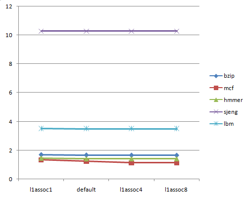
</p>


As we can see the increase of the associativity of L1 caches does not impact ,in general, the total CPI. The only benchmark that shows a decrease in CPI is the *mcf*.


---

##### 2.1.4 Associativity of L2 cache

The size of L2 cache is changed respectively to the values 2, 4 and 16. The results are shown below:

| Benchmarks |   bzip   |   mcf    |  hmmer   |   sjeng   |   lbm    |
| :--------: | :------: | :------: | :------: | :-------: | :------: |
|  l2assoc2  | 1,697535 | 1,341859 | 1,448249 | 10,274614 | 3,510727 |
|  l2assoc4  | 1,690782 | 1,341817 | 1,448249 | 10,277417 | 3,51034  |
|  default   | 1,673085 | 1,251067 |  1,4041  | 10,276466 | 3,49527  |
| l2assoc16  | 1,673782 | 1,251085 |  1,4041  | 10,277003 | 3,49527  |

<p allign = "center">
    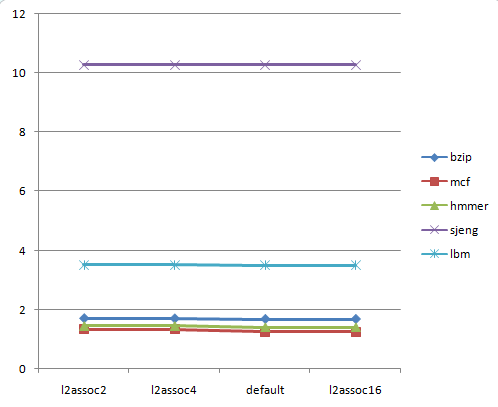
</p>


Similarly with the L1 cache associativity, also the L2 cache associativity does not affect the performance of the system, except for the case of *mcf* benchmark.


---

##### 2.1.5 Size of cache line

Last but not least the contribution of the cache line size to the CPIs is studied. For this reason we change its values to 16B, 32B and 128 B respectively. The results are shown below:

| Benchmarks |   bzip   |   mcf    |  hmmer   |   sjeng   |   lbm    |
| :--------: | :------: | :------: | :------: | :-------: | :------: |
|   line16   | 2,11314  | 1,692583 | 1,517801 | 33,485377 | 9,804702 |
|   line32   | 1,86237  | 1,434275 | 1,462952 | 17,647723 | 5,610684 |
|  default   | 1,673085 | 1,251067 |  1,4041  | 10,276466 | 3,49527  |
|  line128   | 1,67948  | 1,322353 | 1,455582 | 6,806774  | 2,601588 |
|  line256   | 1,653557 | 1,297998 | 1,48923  | 5,175870  | 1,996237 |

<p allign = "center">
    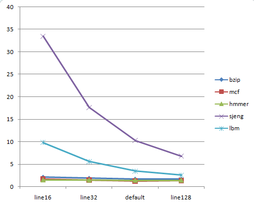
</p>


In this graph we can finally observe some great impact of a system configurable parameter to the CPI. The decrease of CPI for the last two benchmarks, *sjeng* and *lbm* is enormous, while a decrease is also appeared in the *bzip* and *mcf*. The results make clearly sense as a greater cache line size exploits more **spatial locality**, by the means of effectively prefetching data that we have not explicitly asked for.


##### 2.1.6 Multiple parameters alteration

In this final section the contribution of the combination of several parameters to the total CPIs is analyzed. For this reason the Associativity of L1 caches is changed to 1, while the Associativity of L2 cache takes the values 2, 4, 16 and the cache line size takes the values 16, 32, 128 respectively. 

|     Benchmarks     |   bzip   |   mcf    |  hmmer   |   sjeng   |   lbm    |
| :----------------: | :------: | :------: | :------: | :-------: | :------: |
| l1assoc1_l2assoc2  | 1,697535 | 1,341859 | 1,448249 | 10,274614 | 3,510727 |
| l1assoc1_l2assoc4  | 1,690782 | 1,341817 | 1,448249 | 10,277417 | 3,51034  |
|      default       | 1,673085 | 1,251067 |  1,4041  | 10,276466 | 3,49527  |
| l1assoc1_l2assoc16 | 1,692417 | 1,341895 | 1,448249 | 10,277195 | 3,510641 |

|    Benchmarks    |   bzip   |   mcf    |  hmmer   |   sjeng   |   lbm    |
| :--------------: | :------: | :------: | :------: | :-------: | :------: |
| l1assoc1_line16  | 2,11314  | 1,692583 | 1,517801 | 33,485377 | 9,804702 |
| l1assoc1_line32  | 1,86237  | 1,434275 | 1,462952 | 17,647723 | 5,610684 |
|     default      | 1,673085 | 1,251067 |  1,4041  | 10,276466 | 3,49527  |
| l1assoc1_line128 | 1,67948  | 1,322353 | 1,455582 | 6,806774  | 2,601588 |

<p>
    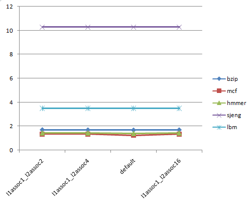 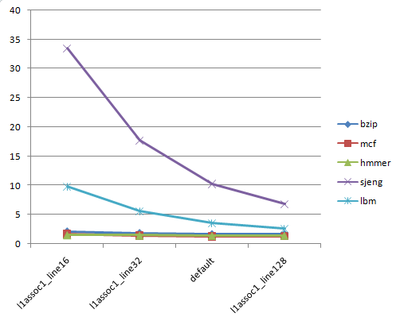
</p>


Even in this case of multiple parameters changing to measure CPI, it is easily observable that the primary reason of CPI reduction is the increase of cache line size.


### 3. Cost of Performance and Optimization

This final section investigates the influence of the parameters of Cache Memories to the cost of the system. Through this analysis it will be possible to choose the most "value for money" design to achieve low CPI and low cost. With the term cost we do not only name the manufacturing cost, but also the speed, the size and the complexity of the circuit.

The manufacturers have always go for a compromise. The most important reason is the architectural limitations. A huge number of transistors is needed to build a cache. It is also one of the main energy absorbing elements. Therefore, selecting the capacitance must be balanced between the performance, power consumption and the surface of the core, and thus the cost of production. Moreover, the more cache means a larger area of memory you need to "search". Thus, the access time can be longer.

On the other hand, Associativity plays also a dominant role in the cost function, affecting its complexity. Multiplexers are added to Caches, to achieve different kinds of Associativity. As L1 Caches are closer to the CPU, those Multiplexers pay a higher cost, regarding space.

Finally, although the increase of **Cache Line** size takes advantage of **spatial locality**, and thus reducing Miss Rate of the caches, it makes the memory slower. The reason for this to happen is that a larger Memory Block needs more time to be fetched.

As Associativity, also Cache Line size pays a higher cost for the L1 Cache, because this level cache frequently accessed and has to be faster. 

For all the reasons described above, combined with valuable information we got during studying various publications, we came up with the following cost function:

<p allign = 'center'>
    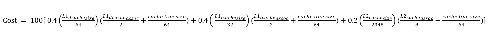
</p>

Obviously the variables went through normalization, dividing with the default values and the total function was multiplied by 100 for reasons of better results interpretation. The cost of each simulation can be seen in the following table:

| Sim. | L1 dcache size | L1 dcache assoc. | L1 icache size | L1 icache assoc. | L2 cache size | L2 cache assoc. | Cache Line size | Cost |
| :--: | :------------: | :--------------: | :------------: | :--------------: | :-----------: | :-------------: | :-------------: | :--: |
|  1   |      64kB      |        2         |      32kB      |        2         |    2048kB     |        8        |       64        | 100  |
|  2   |      32kB      |        2         |      16kB      |        2         |    2048kB     |        8        |       64        |  60  |
|  3   |     128kB      |        2         |      64kB      |        2         |    2048kB     |        8        |       64        | 180  |
|  4   |      64kB      |        2         |      32kB      |        2         |     512kB     |        8        |       64        |  85  |
|  5   |      64kB      |        2         |      32kB      |        2         |    1024kB     |        8        |       64        |  90  |
|  6   |      64kB      |        2         |      32kB      |        2         |    4096kB     |        8        |       64        | 120  |
|  7   |      64kB      |        1         |      32kB      |        1         |    2048kB     |        8        |       64        |  80  |
|  8   |      64kB      |        4         |      32kB      |        4         |    2048kB     |        8        |       64        | 140  |
|  9   |      64kB      |        8         |      32kB      |        8         |    2048kB     |        8        |       64        | 220  |
|  10  |      64kB      |        1         |      32kB      |        1         |    2048kB     |        2        |       64        | 92.5 |
|  11  |      64kB      |        1         |      32kB      |        1         |    2048kB     |        4        |       64        |  95  |
|  12  |      64kB      |        1         |      32kB      |        1         |    2048kB     |       16        |       64        | 110  |
|  13  |      64kB      |        2         |      32kB      |        2         |    2048kB     |        8        |       16        | 62.5 |
|  14  |      64kB      |        2         |      32kB      |        2         |    2048kB     |        8        |       32        |  75  |
|  15  |      64kB      |        2         |      32kB      |        2         |    2048kB     |        8        |       128       | 150  |
|  16  |      64kB      |        2         |      32kB      |        2         |    2048kB     |        8        |       256       | 250  |


In the following analysis we will merge the results of chapter 2.1 about the CPI with the cost calculated above, for each of the 16 different cases, in order to calculate a *value for cost choice* to implement our system: 


##### 3.1.1 bzip

<p>
    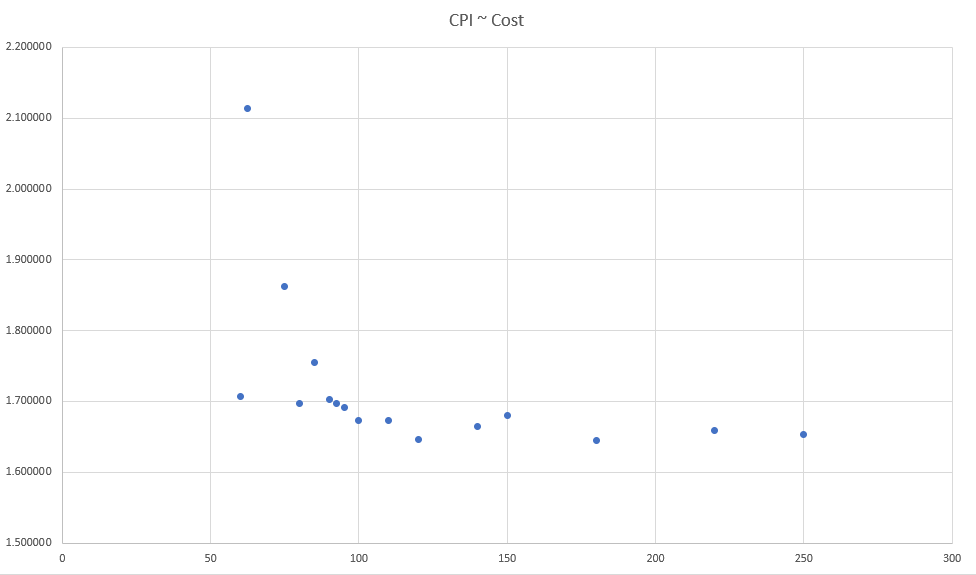
</p>


One can easily observe that CPI is a descending function of the Cost. That means that in order to decrease CPI the cost must be increased. This *tradeoff* between CPI and cost is completely reasonable and we have to  find the *optimal point* of the curve that satisfies the followings:

- Cost as small as possible
- CPI as small as possible

The search of this optimal point is a common scientific problem, when *tradeoffs* are met and is usually solved following the **elbow rule**. Specifically, an imaginary line will be drown starting from the start of the axis and will be slided to the points of the curve, keeping its slope constant. The first point this line meets is picked as the *optimum point*. When we have not any *priori* information about the weights of the two values in the tradeoff, the slope of the line is *-45 degrees*. 

In this case the optimum point corresponds to the one with (60, 1.70720). This point corresponds to the architecture with the decreased L1 icache and dcache size at 16 and 32 kB respectively. Explicitly, the parameters of the system will be set as:

-  **L1 icache** *size=16kB* & *assoc=2*
- **L1 dcache** *size=32kB* & *assoc=2*
- **L2 cache** *size=2048kB* & *assoc=8*
- *cache line size=64B*

---

##### 3.1.2 mcf

<p>
    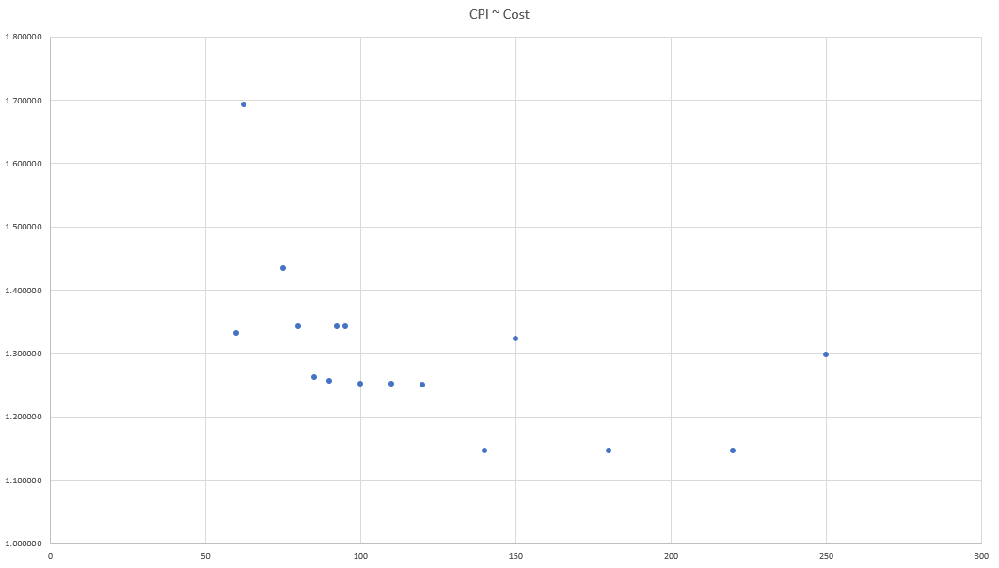
</p>


---

##### 3.1.3 hmmer

<p>
    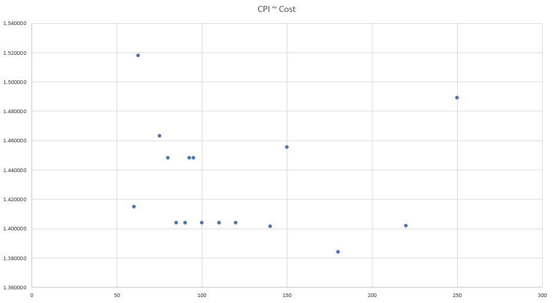
</p>


---

##### 3.1.4 sjeng


<p>
    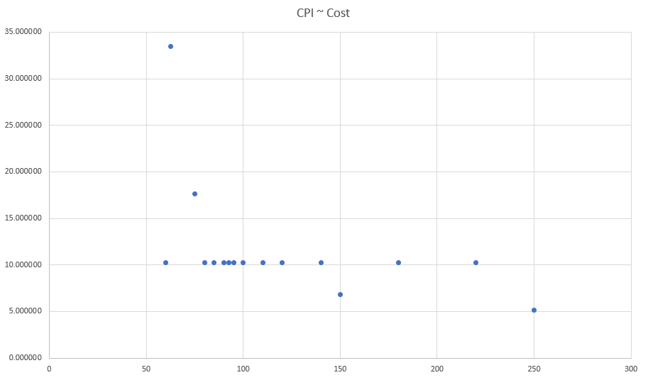
</p>


---

##### 3.1.5 lbm

<p>
    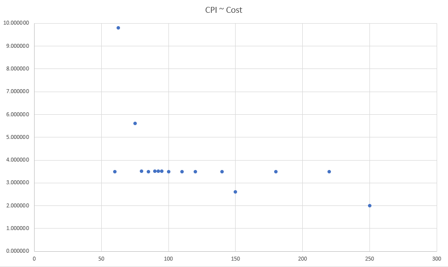
</p>


##### 3.2 Conclusion

Obviously, the optimum point at every benchmark is selected as the one with *Cost = 60*, which corresponds to the system with 16kB and 32kB as sizes for the L1 icache and L1 dcache respectively. This observation shows that we have consider the weight of those parameters very high, while designing the cost function. Therefore the size of L1 caches is the dominant factor in the equation and clearly affects the *tradeoff*. 

The examination of the weights of each parameters in the cost function is an issue to be resolved in the future, so that a more balanced cost function will be constructed.


### 4. Project Review

