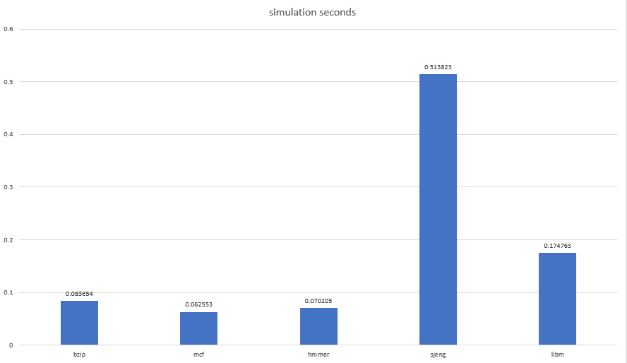
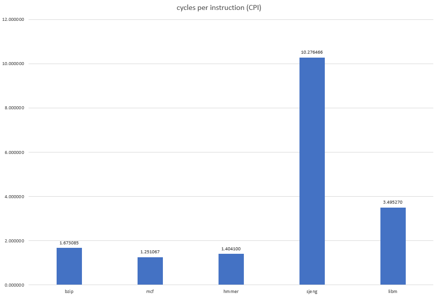
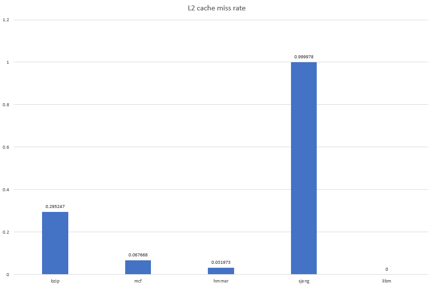
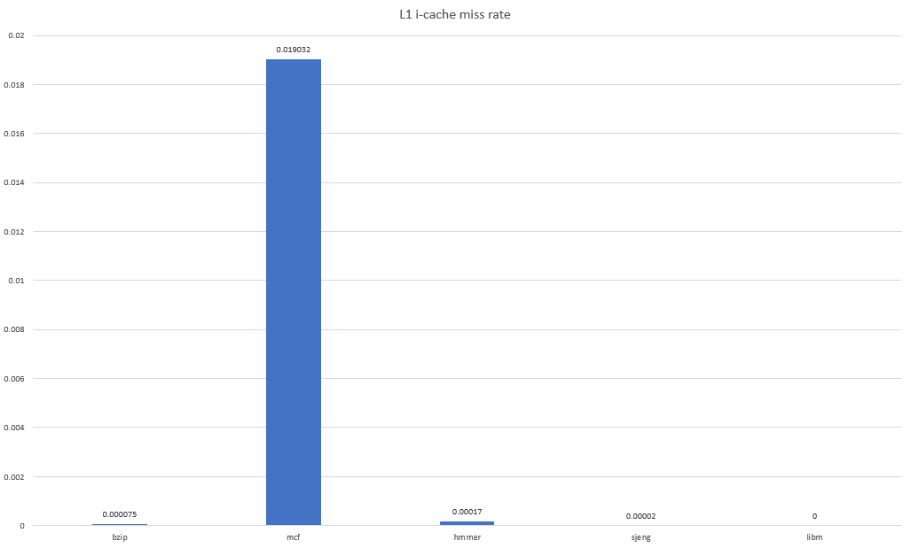
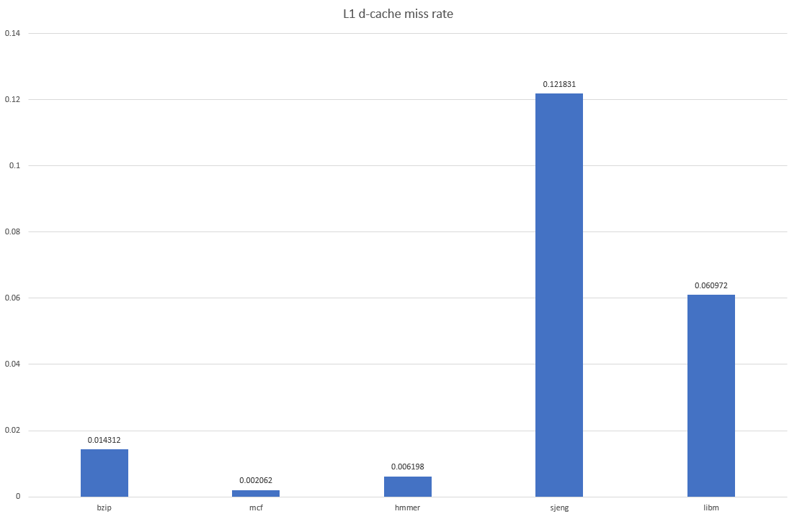

# Lab 2


### 1. Run SPEC CPU2006 Benchmarks in gem5

In this first section the following **SPEC CPU2006 Benchmarks** were used, in order to discovers the CPU capabilities:

- **401.bzip2** is a benchmark which forces the CPU compress and decompress different types of files.

  ```bash
  ./build/ARM/gem5.opt -d spec_results/specbzip configs/example/se.py --cpu-type=MinorCPU --caches --l2cache -c spec_cpu2006/401.bzip2/src/specbzip -o "spec_cpu2006/401.bzip2/data/input.program 10" -I 100000000
  ```

- **429. mcf** is a benchmark which is derived from **MCF**, a program used for single-depot vehicle scheduling in public mass transportation.

  ```bash
  ./build/ARM/gem5.opt -d spec_results/specmcf configs/example/se.py --cpu-type=MinorCPU --caches --l2cache -c spec_cpu2006/429.mcf/src/specmcf -o "spec_cpu2006/429.mcf/data/inp.in" -I 100000000
  ```

- **456.hmmer** is a benchmark which forces CPU to analyze protein sequences using profile hidden Markov models

  ```bash
  ./build/ARM/gem5.opt -d spec_results/spechmmer configs/example/se.py --cpu-type=MinorCPU --caches --l2cache -c spec_cpu2006/456.hmmer/src/spechmmer -o "--fixed 0 --mean 325 --num 45000 --sd 200 --seed 0 spec_cpu2006/456.hmmer/data/bombesin.hmm" -I 100000000
  ```

- **458.sjeng** is a benchmark which uses a highly-ranked chess program that also plays several chess variants.

  ``` bash
  ./build/ARM/gem5.opt -d spec_results/specsjeng configs/example/se.py --cpu-type=MinorCPU --caches --l2cache -c spec_cpu2006/458.sjeng/src/specsjeng -o "spec_cpu2006/458.sjeng/data/test.txt" -I 100000000
  ```

- **470.lbm** is a benchmark which implements the so-called "Lattice Boltzmann Method" to simulate incompressible fluids in 3D.

  ```bash
  ./build/ARM/gem5.opt -d spec_results/speclibm configs/example/se.py --cpu-type=MinorCPU --caches --l2cache -c spec_cpu2006/470.lbm/src/speclibm -o "20spec_cpu2006/470.lbm/data/lbm.in 0 1 spec_cpu2006/470.lbm/data/100_100_130_cf_a.of" -I 100000000
  ```

  

#### 1.1 Cache Memory parameters

The generated files *config.ini* contain information about all configurable parameters of the simulation. The parameters about cache memories mainly concern: 

* **L1 Instruction Cache size**

  *Line 833, [system.cpu.icache]*: The variable size = 32768 indicates that the L1-Instruction Cache has a size of **32kB**.

* **L1 Instruction Cache Associativity**

  *Line 816, [system.cpu.icache]*: The variable assoc = 2 indicates that the L1-Instruction Cache has a 2-way Set Associativity.

* **L1 Data Cache size**

  *Line 169, [system.cpu.dcache]*: The variable size = 65536 indicates that the L1-Data Cache has a size of **64kB**.

* **L1 Data Cache Associativity**

  *Line 152, [system.cpu.dcache]*: The variable assoc = 2 indicates that the L1-Data Cache has a 2-way Set Associativity.

* **L2 Cache size**

  *Line 1078, [system.l2]*: The variable size = 2097152 indicates that L2-Cache has a size of **2MB**.

* **L2 Cache Associativity**

  *Line 1061, [system.l2]*: The variable assoc = 8 indicates that L2-Cache has a 8-way Set Associativity.

* **Cache Line size**

  *Line 15, [system]*: The variable cache_line_size = 64 indicates that the size of the Cache Line is **64 Bytes**

---


#### 1.2 Execution Time, CPI & Miss Rates

The following results about the simulation time, the CPI, L1 icache miss rate, L1 dcache miss rate and L2 cache miss rate were observed, running the benchmarks with the default parameters:

- **L1 icache** *size=32kB* & *assoc=2*
- **L1 dcache** *size=64kB* & *assoc=2*
- **L2 cache** *size=2048kB* & *assoc=8*
- *cache line size=64B*

|           | simulation seconds | cycles per instruction (CPI) | L2 cache miss rate | L1 i-cache miss rate | L1 d-cache miss rate |
| :-------: | :----------------: | :--------------------------: | :----------------: | :------------------: | :------------------: |
| **bzip**  |      0.083654      |           1.673085           |      0.295247      |       0.000075       |       0.014312       |
|  **mcf**  |      0.062553      |           1.251067           |      0.067668      |       0.019032       |       0.002062       |
| **hmmer** |      0.070205      |           1.404100           |      0.031973      |       0.000170       |       0.006198       |
| **sjeng** |      0.513823      |          10.276466           |      0.999978      |       0.000020       |       0.121831       |
|  **lbm**  |      0.174763      |           3.495270           |      0.999940      |       0.000095       |       0.060972       |

The results can be more easily interpreted, using plots:

<p allign = "center">
    

---


<p allign = "center">
    

---


<p allign = "center">
    

---


<p allign = "center">
    

---


<p allign = "center">
    


Obviously, the **CPI** is affected both from L2 miss rate and L1 miss rate. As those miss rates are increased, CPI is also increased. This fact makes sense because every time the CPU makes a miss in L1 cache or L2 cache, there is a time penalty. Nevertheless, the time penalty of L2 cache is significantly bigger, as the L2 cache is a slower memory than L1 cache. 


---

#### 1.3 Understanding System Clock and CPU Clock

The configuration file *config.ini* includes useful information about different clocks of the generated system. The clock under the tag **[system.clk_domain]** and the clock under the tag **[system.cpu_clk_domain]**. This values refer to the total number of system ticks, in order to produce a signal (clock). Given that the system simulates 1,000,000,000,000 , the **system.clk_domain clock**, which is 1000 ticks, corresponds to a clock of 1 GHz. Similarly, the **system.cpu_clk_domain clock**, which is 500 ticks, corresponds to a clock of 2 GHz. These 2 different clocks define different subsystems of the simulated system, namely the **CPU** and the **Main Memory**. L2 cache takes over the role of a *communication bridge*, between these two systems and for this reason should be able to communicate in different clock rates, when *system.clk_domain* and *system.cpu_clk_domain* clock have not the same value. Changing the CPU clock's frequency to 1GHz comes with a change at *system.cpu_clk_domain* clock at 1GHz, which also affects the communication rate between CPU and L2 cache. The results of the benchmarks can be seen below:

|           | simulation seconds | cycles per instruction (CPI) | L2 cache miss rate | L1 i-cache miss rate | L1 d-cache miss rate |
| :-------: | :----------------: | :--------------------------: | :----------------: | :------------------: | :------------------: |
| **bzip**  |      0.160359      |           1.603595           |      0.295235      |       0.000075       |       0.014123       |
|  **mcf**  |      0.123265      |           1.232645           |      0.067668      |       0.019046       |       0.002062       |
| **hmmer** |      0.140134      |           1.401339           |      0.031973      |       0.000170       |       0.006197       |
| **sjeng** |      0.705640      |           7.056395           |      0.999978      |       0.000020       |       0.121831       |
|  **lbm**  |      0.262262      |           2.622616           |      0.999940      |       0.000095       |       0.060972       |


Comparing this table with the previous results with the CPU clock at 2GHz, we come up with some meaningful conclusions. First of all the Miss Rates of the different levels of caches are not affected of the change in the CPU clock. On the other hand, what is strongly connected with the CPU clock are the simulation seconds and the CPIs. The reason for this to happen is that L1 icache, as well ass L2 dcache are clocked in the CPU frequency and so the miss penalty time is higher. We can see the development of those measurements in the following table:

|           | Simulation Seconds Increase | Cycles pre Instruction Decrease |
| :-------: | :-------------------------: | :-----------------------------: |
| **bzip**  |           91.71%            |              4.15%              |
|  **mcf**  |           97.05%            |              1.47%              |
| **hmmer** |           99.61%            |              0.01%              |
| **sjeng** |           37.33%            |             31.33%              |
|  **lbm**  |           38.62%            |             24.97%              |

The first three benchmarks, namely *bzip*, *mcf* and *hmmer* had the most remarkable increment in the simulation time, as the total seconds were almost doubled. On the other hand, the last two benchmarks, namely *sjeng* and *lbm* show a larger decrease on the total CPI.

In conclusion the most important parameter of the simulated system by the means of time performance is the L2 cache. Going back from 1GHz CPU clock to 2GHz we can observe that the benchmarks with high L2 Cache Miss Rates are not able to achieve such a simulation time compression, as the other ones. The reason behind this observation is the high time-penalty of the L2 cache when a "miss" occurs, due to the slower speed of this level of cache memory. 


### 2. Design Exploration & Performance Optimization

Now that we have already run some basic benchmarks it is the time to analyze the influence of specific parameters to the performance of the system, measured in CPIs. The configurable parameters are given to the system with the form of the following arguments:

- *--l1i_size*
- *--l1i_assoc*
- *--l1d_size*
- *--l1d_assoc*
- *--l2_size*
- *--l2_assoc*
- *--cacheline_size*


#### 2.1. Influence of Parameters in CPIs

The default parameters of the system are:

- **L1 icache** *size=32kB* & *assoc=2*
- **L1 dcache** *size=64kB* & *assoc=2*
- **L2 cache** *size=2048kB* & *assoc=8*
- *cache line size=64B*

These parameters will be modified in order to achieve high system performance by the meaning of low CPIs. In this experiment we will take into account that these parameters can only take distinct values, as well as that there exist some upper limitations:

- Maximum combined L1 instruction-cache size and l1 data-cache size must not exceed 256kB.

- Maximum L2 cache size must not exceed 4MB.
- Cache size is discrete powers of 2 (16kB, 32kB,...) which means that L1 icache and L1 dcache are at 16kB,32kB,64kB,128kB and L2 Cache is respectively 512kB, 1024kB, 2048kB, 4096kB.

- Commonly used n-set Associativities are 1,2,4,8,16

- Commonly used cache line sizes are 16,32,64,128 Bytes.

---

##### 2.1.1 Size of L1 cache (icache & dcache)

On this point, we will also make the assumption that the the sizes of L1 i-cache and L1 d-cache retain the analogy 1:2, in order to simplify our analysis. At first their capacity will be decreased by one half (icache : 16kB and dcache : 32kB) and then it will be doubled (icache: 64 kB and dcache 128 kB). The limitation of summed size less than 256 kB forbids additional experiments. The results are show below:


[]


---

##### 2.1.2 Size of L2 cache

The size of L2 cache is changed respectively to the values 512kB, 1024kB and 4096kB. The results are shown below:


[]


---

##### 2.1.3 Associativity of L1 cache (icache & dcache)

As we did with the size of L1 caches, also here we assume that the associativities of L1 icache and dcache are mightily connceted. The associativity of L1 caches is changed respectively to the values 1, 4 and 8. The results are shown below:


[]


---

##### 2.1.4 Associativity of L2 cache

The size of L2 cache is changed respectively to the values 2, 4 and 16. The results are shown below:

 


[]


---

##### 2.1.5 Size of cache line

Last but not least the contribution of the cache line size to the CPIs is studied. For this reason we change its values to 16B, 32B and 128 B respectively. The results are shown below:


[]


##### 2.1.6 Multiple parameters alteration

In this final section the contribution of the combination of several parameters to the total CPIs is analyzed. For this reason the Associativity of L1 caches is changed to 1, while the Associativity of L2 cache takes the values 2, 4, 16 and the cache line size takes the values 16, 32, 128 respectively. 