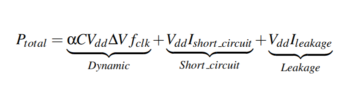

# Lab 3

### 1. McPAT

McPAT (**M**ulti**c**ore **P**ower, **A**rea, and **T**iming) is an integrated power, area, and timing modeling framework for multithreaded, multicore, and manycore architectures. It models power, area, and timing simultaneously and consistently and supports comprehensive early stage design space exploration for multicore and manycore processor configurations ranging from 90nm to 22nm and beyond. McPAT includes models for the components of a complete chip multiprocessor, including in-order and out-of-order processor cores, networks-on-chip, shared caches, and integrated memory controllers. McPAT models timing, area, and dynamic, short-circuit, and leakage power for each of the device types forecast in the ITRS roadmap including bulk CMOS, SOI, and double-gate transistors. McPAT has a flexible XML interface to facilitate its use with different performance simulators.

To download McPAT the following GitHub Repository has to be cloned:

```
$ git clone https://github.com/kingmouf/cmcpat.git my_mcpat
```


##### 1.1 Dynamic Power & Leakage

Inside the folder *ProcessorDescriptionFiles* of the installation there are *xml* files with different processors specification. To run McPAT for Xeon processor, the following command must be used:

```
$ ./mcpat -infile ProcessorDescriptionFiles/Xeon.xml -print_level 1
```

where 1 stands for how analytic the results printed in the console will be.

Observing the results we can see informations about **Dynamic Power** and **Leakage**.

- **Peak Power**: is the upper limit of the total power that the CPU can dissipate. As we can see in the following equation, the power dissipation of CMOS circuits consists of three main components:

  <p allign = 'left'>
      
  </p>

- **Dynamic Power**: is the power spent in charging and discharging the capacitive loads when the circuit switches state, where *C* is the total load capacitance, *Vdd* is the supply voltage, *∆V* is the voltage swing during switching, *fclk* is the clock frequency, and *α* indicates the fraction of total circuit capacitance being charged during a clock cycle.

- **Short-circuit Power**: is the power consumed when both the pull-up and pull-down devices in a CMOS circuit are partially on for a small, but finite amount of time. Short-circuit power is about 10% of the total dynamic power.

- **Leakage**: this term refers to the static power consumed due to leakage current through the transistors, which in reality function as “imperfect” switches. There are two distinct leakage mechanisms, and the magnitude of each leakage current is proportional to the width of the transistor and depends on the logical state of the device. The first type of leakage, subthreshold leakage, occurs when a transistor that is supposedly in the off state actually allows a small current to pass between its source and drain. 


##### 1.2 Low vs High Power CPU

Let's suppose, at this point, that we have to choose between two processors, one consuming **4 Watt** and another consuming **40 Watt**, to embed in a battery-supplied system. To achieve a longer battery life with the second processor some conditions must be met:

- The simulation time, in which the processor is running must be compacted, which can be achieved with higher clock frequency.

