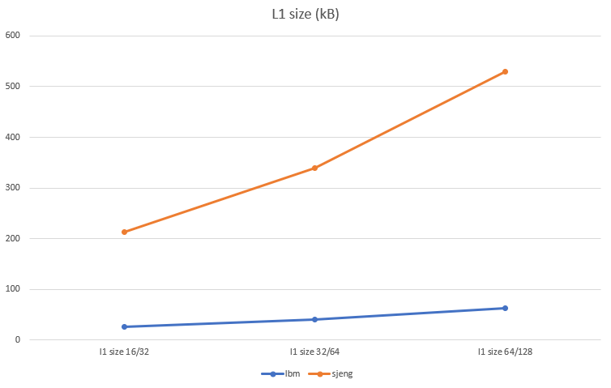

# Lab 3

### 1. McPAT

McPAT (**M**ulti**c**ore **P**ower, **A**rea, and **T**iming) is an integrated power, area, and timing modeling framework for multithreaded, multicore, and manycore architectures. It models power, area, and timing simultaneously and consistently and supports comprehensive early stage design space exploration for multicore and manycore processor configurations ranging from 90nm to 22nm and beyond. McPAT includes models for the components of a complete chip multiprocessor, including in-order and out-of-order processor cores, networks-on-chip, shared caches, and integrated memory controllers. McPAT models timing, area, and dynamic, short-circuit, and leakage power for each of the device types forecast in the ITRS roadmap including bulk CMOS, SOI, and double-gate transistors. McPAT has a flexible XML interface to facilitate its use with different performance simulators.

To download McPAT the following GitHub Repository has to be cloned:

```
$ git clone https://github.com/kingmouf/cmcpat.git my_mcpat
```

##### 1.1 Dynamic Power & Leakage

Inside the folder *ProcessorDescriptionFiles* of the installation there are *xml* files with different processors specification. To run McPAT for **Xeon** processor, the following command must be used:

```bash
$ ./mcpat -infile ProcessorDescriptionFiles/Xeon.xml -print_level 1
```

where 1 stands for how analytic the results printed in the console will be.

Observing the results we can see informations about **Dynamic Power** and **Leakage**.

- **Peak Power**: is the upper limit of the total power that the CPU can dissipate. As we can see in the following equation, the power dissipation of CMOS circuits consists of three main components:

  <p>
      
  </p>

- **Dynamic Power**: is the power spent in charging and discharging the capacitive loads when the circuit switches state, where *C* is the total load capacitance, *Vdd* is the supply voltage, *∆V* is the voltage swing during switching, *fclk* is the clock frequency, and *α* indicates the fraction of total circuit capacitance being charged during a clock cycle.

- **Short-circuit Power**: is the power consumed when both the pull-up and pull-down devices in a CMOS circuit are partially on for a small, but finite amount of time. Short-circuit power is about 10% of the total dynamic power.

- **Leakage**: this term refers to the static power consumed due to leakage current through the transistors, which in reality function as “imperfect” switches. There are two distinct leakage mechanisms, and the magnitude of each leakage current is proportional to the width of the transistor and depends on the logical state of the device. The first type of leakage, **subthreshold leakage**, occurs when a transistor that is supposedly in the off state actually allows a small current to pass between its source and drain. The second type, **gate leakage**, is the current that leaks through the gate terminal.

- **Dynamic Power**: is the total energy consumed for the execution of a program, divided by the simulation time

Consequently, we can understand that **Dynamic Power** is consumed, due to the capacitive load of the switching transistors, while **Leakage** refers to the imperfections of the inactive transistors of the system. 

Therefore, running a demanding program in our system, which requires more transistor to switch HIGH/LOW states, would result in increased Dynamic Power. On the other hand, a less demanding program, which would use a significant less number of transistor, causing more in idle transistor and thus expanded Leakage.

Obviously, those values do not depend on the execution time, because we are referring to Watt (Joule/sec),


##### 1.2 Low VS High Power CPU in a battery-supplied system

Let's suppose, at this point, that we have to choose between two processors, one consuming **4 Watt** and another consuming **40 Watt**, to embed in a battery-supplied system. Achieving a longer battery life with the second processor requires reduced execution time, namely the time of processor's activity. This information about the **total simulation time** is not produced by McPAT. Therefore, we could combine **McPAT** with **gem5** to calculate the energy efficiency of each processor.

Moreover, the efficiency of a CPU can be increased via the compression of *Dynamic Power* and *Leakages*:

- A reduction in the clock frequency of the CPU, as well as the parameter *a*, would have a straight impact on the *Dynamic Power* by reducing the frequency of transistors switchings, however the system would become significantly slower.
- The supply Voltage of the chip could be minimized, in order to achieve not only less *Dynamic Power*, but also less *Leakages*.
-  The *cut-off* of the supply of inactive transistors should be considered, in order to reduce the *Leakage*.


##### 1.3 Intel Xeon VS ARM Cortex-A9 

McPAT comes with some build-in *xml* files with specifications about common processors, under the directory *ProcessorDescriptionFiles*. In this section, *Intel Xeon* and *ARM Cortex-A9* will be examined in terms of **Energy Efficiency**. Specifically, let's suppose that *Xeon* is 40 times faster of *Cortex-19*, regarding execution time. 

To simulate *Intel Xeon* we run the command:

```bash
$ ./mcpat -infile ProcessorDescriptionFiles/Xeon.xml -print_level 1 > Xeon.txt
```

and for the *ARM Cortex-A9*:

```bash
$ ./mcpat -infile ProcessorDescriptionFiles/ARM_A9_2GHz.xml -print_level 1 > ARM_A9.txt
```

The results are illustrated in the following table


|                                            |  Intel Xeon  | ARM Cortex-A9 |
| :----------------------------------------: | :----------: | :-----------: |
|               **Technology**               |    65 nm     |     40 nm     |
|         **Core Clock Rate (MHz)**          |     3400     |     2000      |
|                  **Area**                  | 410.507 mm^2 | 5.39698 mm^2  |
|               **Peak Power**               |  134.938 W   |   1.74189 W   |
|             **Total Leakage**              |  36.8319 W   |  0.108687 W   |
|              **Peak Dynamic**              |  98.1063 W   |   1.6332 W    |
|          **Subthreshold Leakage**          |  35.1632 W   |  0.0523094 W  |
| **Subthreshold Leakage with power gating** |  16.3977 W   |       -       |
|              **Gate Leakage**              |  1.66871 W   |  0.0563774 W  |
|            **Runtime Dynamic**             |  72.9199 W   |   2.96053 W   |


The energy consumption over a simulation time is given by the formula above:


$$
Energy = (Runtime Dynamic + Total Leakage) * Simulation Time
$$


The constraint of speed means that if *Xeon* needs *t* seconds for the execution of a program, *Cortex-A9* needs *40t*. Therefore the results for each processors energy are:


- *Xeon*: 
  $$
  Energy = [72.9199 W + 36.8319 W] * tsec = 109.7518 t Joules
  $$


- *Cortex-A9*:

$$
Energy = [2.96053 W + 0.108687 W] * 40tsec = 122.76868 t Joules
$$


Although Xeon seems to consume less energy than Cortex-A9, Xeon will not shut down when it executes the program, but it will wait for the Cortex-A9 in idle state. For this *39t* remaining time, current will leak, due to *Subthreshold Leakage* and *Gate Leakage*. Therefore, Xeon will consume extra *39t`*`36.8319  =  1436.4441t * Joule.  Obviously, *Xeon* cannot be more energy efficient than *ARM Cortex-A9*, for a battery-supplied system.


### 2. Using gem5 & McPAT to optimize EDP

In this section we will use bot gem5 and McPAT to optimize the Energy-Delay Product (EDP). Specifically, we will use a python file *GEM5ToMcPAT.py*, which takes as inputs the *stats.txt* and *config.json* files for each simulation in the previous laboratory exercise, as well as an *inorder_arm.xml* file from the build-in *Processor Description Files* of McPAT and produces an output *.xml* with the name *my_output.xml* for each simulation.

This *my_output.xml* file contains information about the architecture of the simulated processor and is in a form, suitable for McPAT. The next step is to run McPAT with this file as input and produce a *results.txt* file for each simulation which contains the output about *Power* and *Leakages* that McPAT can calculate.

Finally, we call *print_energy.py* script for each simulation, in order to calculate the energy produced by each simulated processor, by multiplying *power* and *simulated seconds*.

We have to mention that each of the scripts described above is called inside a corresponding bash file, in order to be executed for each simulation.


#### 2.1 Energy Consumed

The energy consumed (in miliJoules) for each benchmark's simulation is illustrated in the following table:

|                | bzip       | hmmer      | lbm        | mcf        | sjeng       |
| -------------- | ---------- | ---------- | ---------- | ---------- | ----------- |
| default        | 123.943021 | 106.538615 | 232.742198 | 93.410958  | 659.168626  |
| l1 assoc 1     | 124.971035 | 109.20671  | 233.146318 | 99.427905  | 657.712528  |
| l1 assoc 4     | 106.928349 | 92.998103  | 198.725279 | 75.459546  | 563.027582  |
| l1 assoc 8     | 118.647121 | 105.625314 | 217.946413 | 85.437007  | 627.626176  |
| l1 size_1632   | 73.682325  | 62.016195  | 143.627813 | 59.393098  | 413.516162  |
| l1 size_64128  | 186.358536 | 159.907914 | 361.101253 | 131.292494 | 1029.859502 |
| l2 assoc 2     | 124.26746  | 106.531103 | 232.707071 | 93.404624  | 659.145349  |
| l2 assoc 4     | 123.889145 | 106.532928 | 232.714061 | 93.401966  | 659.0669    |
| l2 assoc 16    | 124.009691 | 106.557781 | 232.799695 | 93.43128   | 659.377459  |
| l2 size_512    | 127.961542 | 106.134445 | 254.979951 | 93.291871  | 654.961541  |
| l2 size_1024   | 125.217515 | 106.298795 | 232.534142 | 93.24774   | 656.784217  |
| l2 size_4096   | 123.157072 | 106.98891  | 234.275757 | 94.029666  | 663.003266  |
| cache line 16  | 78.83968   | 58.463166  | 347.911539 | 55.544176  | 1177.384897 |
| cache line 32  | 93.068378  | 74.916062  | 258.754606 | 65.094718  | 798.776352  |
| cache line 128 | 152.304291 | 128.445683 | 210.371373 | 115.668455 | 531.434776  |
| cache line 256 | 304.841227 |            | 334.941424 | 238.487381 | 837.124316  |


#### 2.2 Peak Power in respect to Processor's Parameters

Our goal in this point is to examine the influence of Processor's Parameters, such as L1 cache size, L1 cache associativity, L2 cache size etc. in the Peak Power generated from McPAT. Obviously, the kind of the benchmark (i.e. bzip, mcf, hmmer, sjeng and lbm) do not affect the Peak Power, because the latter is a measurement, which only depends on the physical hardware available. For this reason, our analysis will focus in a random benchmark, namely bzip.


##### 2.2.1 Size of L1 cache (icache & dcache) 

The Peak Power in Watts in respect to L1 cache size can be seen in the graph below:


<p>
    
</p>


---

##### 2.2.2 Size of L2 cache 

The Peak Power in Watts in respect to L2 cache size can be seen in the graph below:


<p>
    
</p>


---

##### 2.2.3 Associativity of L1 cache (icache & dcache)

The Peak Power in Watts in respect to L1 cache associativity can be seen in the graph below:


<p>
    
</p>


---

##### 2.2.4 Associativity of L2 cache 

The Peak Power in Watts in respect to L2 cache associativity can be seen in the graph below:


<p>
    
</p>


---

##### 2.2.5 Size of Cache Line

The Peak Power in Watts in respect to cache line size can be seen in the graph below:


<p>
    
</p>


---

##### 2.2.6 Conclusion

Obviously, the parameter with the greater impact on the Peak Power is the size of the cache line. The second place of the hierarchy is occupied by the L1 cache. Specifically, the major factor is the size of the L1 caches, while associativity has a minor influence in the peak power. Last but not least, the L2 Cache, so in terms of size, as of associativity slightly affects peak power.


#### 2.3  EDP ~ Cost Optimization

In the second laboratory exercise we were asked to find the optimal parameters of the simulated system, in order to optimize the CPI and Cost relationship. In this assignment, we will optimize the designed system, with respect to the **Energy-Delay Product (EDP)**, where **Energy** represents the total energy to run the benchmark and **Delay** stands for the *simulation seconds*, as referred to *stats.txt* file. The following table contains the information about the EDP and the Cost for each simulation:


|                    |  bzip  | hmmer  |  lbm   |  mcf   | sjeng  | Cost |
| :----------------: | :----: | :----: | :----: | :----: | :----: | :--: |
|    **default**     | 10.368 | 7.4795 | 40.675 | 5.8431 | 338.7  | 100  |
|   **l1 assoc 1**   | 10.573 | 7.9079 | 40.924 | 6.6704 | 337.97 |  60  |
|   **l1 assoc 4**   | 8.8992 | 6.5162 | 34.73  | 4.3253 | 289.3  | 180  |
|   **l1 assoc 8**   | 9.8389 | 7.4038 | 38.089 | 4.8972 | 322.48 |  85  |
|  **l1 size_1632**  | 6.2895 | 4.3876 | 25.157 | 3.9531 | 212.36 |  90  |
| **l1 size_64128**  | 15.325 | 11.066 | 63.107 | 7.5256 | 529.18 | 120  |
|   **l2 assoc 2**   | 10.432 | 7.479  | 40.669 | 5.8429 | 338.74 |  80  |
|   **l2 assoc 4**   | 10.359 | 7.4791 | 40.67  | 5.8424 | 338.64 | 140  |
|  **l2 assoc 16**   | 10.378 | 7.4809 | 40.685 | 5.8445 | 338.82 | 220  |
|  **l2 size_512**   | 11.233 | 7.4512 | 44.601 | 5.8833 | 336.58 | 92.5 |
|  **l2 size_1024**  | 10.663 | 7.4627 | 40.753 | 5.8542 | 337.57 |  95  |
|  **l2 size_4096**  | 10.136 | 7.5112 | 40.982 | 5.8794 | 340.46 | 110  |
| **cache line 16**  | 8.2797 | 4.3625 | 170.56 | 3.9449 | 1971.5 | 62.5 |
| **cache line 32**  | 8.5939 | 5.3558 | 72.536 | 4.0548 | 705.1  |  75  |
| **cache line 128** | 12.614 | 8.9352 | 27.154 | 7.2231 | 180.84 | 150  |
| **cache line 256** | 25.204 | 12.617 | 33.431 | 15.478 | 216.64 | 250  |


The results are also visualized in the following graphs:

##### 2.2.1 Size of L1 cache (icache & dcache) 

The EDP in respect to L1 cache size can be seen in the graph below:


<p>
     
</p>


---

##### 2.2.2 Size of L2 cache 

The EDP in respect to L2 cache size can be seen in the graph below:


<p>
     
</p>


---

##### 2.2.3 Associativity of L1 cache (icache & dcache)

The EDP in respect to L1 cache associativity can be seen in the graph below:


<p>
     
</p>


---

##### 2.2.4 Associativity of L2 cache 

The Peak Power in Watts in respect to L2 cache associativity can be seen in the graph below:


<p>
     
</p>


---

##### 2.2.5 Size of Cache Line

The EDP in respect to cache line size can be seen in the graph below:

<p>
     
</p>

---


Looking the table above, we could conclude that the optimal scenario for a small EDP and Cost respectively is the one with L1 cache size 16/32 kB.


### 4 Review

This laboratory exercise offered us really interesting knowledge about the Energy consumed by the hardware inside the processor. We found out that the occupied are by the core is almost the same as by the L2 cache. Moreover we acquired information about the different types of energy consumed of each CPU part, as well as about the Leakage. Finally, we understood the differences between ARM and Intel architectures. We learned that, also in this case there is a *trade-off* , which the architect has to optimize, when designing a processor.

